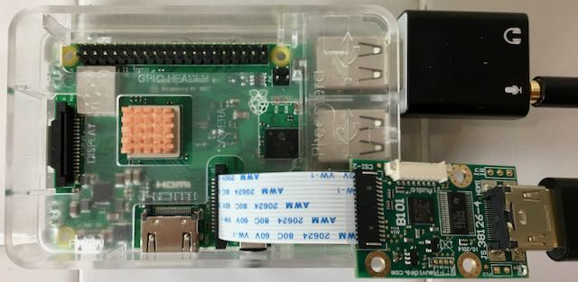
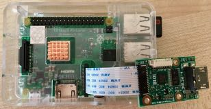
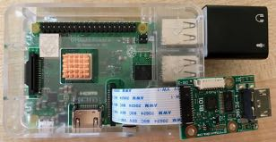
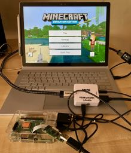
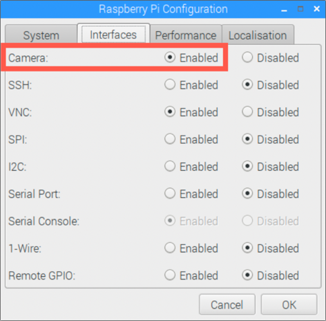
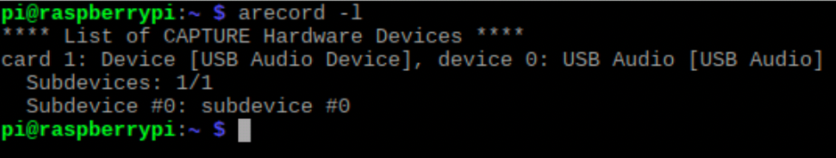
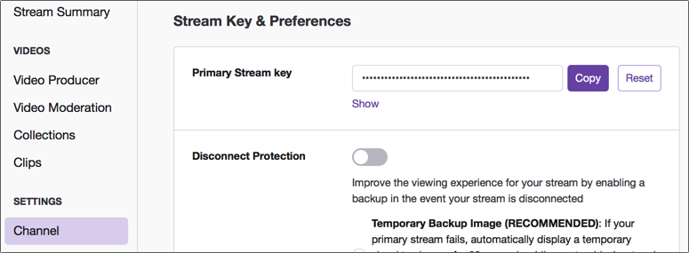
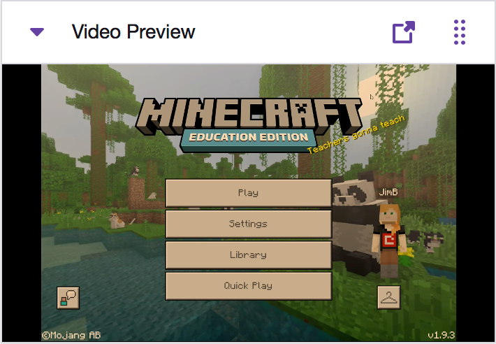

# Twitchberry Pi - a Raspberry Pi based Twitch Streamer

Recently there has been a massive rise in the popularity of live streaming video. Platforms like [Twitch](https://www.twitch.tv) host streams not only from gamers, but from software developers as well.

If you want to stream your gameplay from a console like the PS4 or XBox, then it's pretty easy as the functionality is built in to these consoles. It becomes harder if you want to stream from a console that doesn't support streaming such as older consoles or the newer throwback devices like the [SNES mini classic](https://amzn.to/2L5fO5l) or [Sony PlayStation classic](https://amzn.to/2XJ035G). You can stream from laptops, but the software you need can be complex to set up and require a lot of computing power.

It would be better if there was a box you could just plug the output of your device into and have it stream to Twitch automatically, so the Twitchberry Pi was born!



## The streaming box

The basic aim of the box is to take a stream over HDMI and stream this to Twitch. The idea being a simple device that you can plug anything into, the stream with a simple command.

The Twitchberry Pi is based around a [Raspberry Pi Model 3B+](https://amzn.to/2VjX0Dq).

### Capture an HDMI signal

Raspberry Pis have a camera connector, designed to take an input from a camera module. As well as cameras, there are modules that can be plugged in that do HDMI capture - they capture the signal from an HDMI cable and send the video part using the same connector as the camera modules.

The HDMI capture module I am using is the [Auvidea B101 HDMI to CSI bridge](https://auvidea.eu/b101-hdmi-to-csi-2-bridge-15-pin-fpc/), and you can buy this from [Mouser](https://www.mouser.com/ProductDetail/Auvidea/70501?qs=sGAEpiMZZMu3sxpa5v1qriV5vgGpNFXkQtXOQshEf68%3D).

### Capture an audio signal

The camera port on the Raspberry Pi is designed for a video signal only, it doesn't handle audio so the audio signal from the HDMI source will get lost in conversion. To bring in an audio signal, I'm using a USB sound card. These are pretty cheap, plug into a USB port on the Raspberry Pi and have a 3.5mm microphone jack. I used [a cheap one I found on Amazon](https://amzn.to/2ZvgIeN). If you want to stream using a device that has a headphone socket then you can run a 3.5mm jack cable from the headphone socket to the microphone socket of the USB sound card, otherwise use an HDMI audio splitter such as [this aoeyoo HDMI splitter](https://amzn.to/2VqRz5F) to separate the incoming signal into HDMI and audio.

## Build your own

If you want to build your own Twitchberry Pi, here are the steps to follow.

### Parts list

* [Raspberry Pi Model 3B+](https://amzn.to/2VjX0Dq)
* SD card preloaded with [Raspbian](https://www.raspberrypi.org/downloads/raspbian/)
* Power supply or USB power for the Raspberry Pi
* [Auvidea B101 HDMI to CSI bridge](https://auvidea.eu/b101-hdmi-to-csi-2-bridge-15-pin-fpc/)
* [USB sound card](https://amzn.to/2ZvgIeN)
* [HDMI cable](https://amzn.to/2L3Erzh)
* [3.5mm audio cable](https://amzn.to/2Voh2wx)
* [HDMI audio splitter](https://amzn.to/2VqRz5F) and additional [HDMI cable](https://amzn.to/2L3Erzh) - this is only needed if your source device doesn't have a headphone jack
* Keyboard/mouse/monitor or a Raspberry Pi setup for screen sharing so that you can access the device

### Install the hardware

* With the Raspberry Pi turned off, install the B101 into the camera port. Lift up the holder, slide the ribbon cable in and close the holder.
  
  

* Plug the USB sound card into a free USB socket
  
  

* Connect your device to the HDMI and microphone sockets. If your device only has HDMI, then connect the splitter to the sockets on the Pi and the device to the splitter, powering the splitter using USB from the Pi. There will be a lot of cables, so you may want to use ties or other ways to keep them tidy.
  
  

### Configure Raspbian

The default install of Raspbian should come with all the software you need installed. It is worth updating the software to ensure you have the latest versions installed.

* From the terminal run:
  
  ```sh
  sudo apt-get update
  ```

You will need to enable the camera to take a feed via the HDMI bridge.

* Open the configuration tool by going *Raspberry -> Preferences -> Raspberry Pi Configuration*

* Select the *Interfaces* tab

* Set the *Camera* to **Enabled**
  
  

* Select **OK** and restart the Pi

### Configure VNC

If you are screen sharing toe Raspberry Pi over VNC (you can find a guide on how to do this on [my blog](https://www.jimbobbennett.io/screen-sharing-a-raspberry-pi-from-a-mac/)), then you will need to enable direct capture mode to preview the HDMI input.

* Open the VNC control panel by clicking on the VNC icon in the toolbar

* Select the hamburger in the top right

* Select the *Troubleshooting* tab

* Check the option to *Enable direct capture mode*

* Select **OK**

### Test the video signal

Make sure you have something playing on the source device.

* From the terminal run:
  
  ```sh
  raspivid -f -t 0
  ```

You will see a full screen preview coming from the device connected to the HDMI bridge.

* To close the preview, press *Ctrl+c*

### Test the audio signal

Make sure you have something playing on the source device. You will need an audio output device connected as well, such as headphones via the Raspberry Pis headphone socket, or HDMI audio if you have a monitor connected.

* From the terminal run:

  ```sh
  arecord -l
  ```

  You should see one device - a USB Audio Device.

  

* From the terminal run:

  ```sh  
  arecord --device=plughw:1,0 -d 10 --rate=44000 test.wav
  ```

  This will record 10 seconds of audio from the source device and save it as a file.

* From the terminal run:

  ```sh
  aplay test.wav
  ```

  You will hear the recording being played back. You may want to play with the microphone settings to help get clearer audio.

### Configure Twitch

You will need a Twitch account, a streaming key and your nearest ingest endpoint. The ingest endpoint is a URL where you send your video and audio data to, and ideally you want the one closest to your location.

* Head to [stream.twitch.tv/ingests](https://stream.twitch.tv/ingests/) and find the ingest endpoint nearest to you. This site will show the recommended ones, and it will be something like `rtmp://live-lhr.twitch.tv/app/{stream_key}`. Make a copy of this value somewhere.

* Head to [twitch.tv](https://www.twitch.tv) and sign up or sign in

* Select your avatar in the top-right hand corner and select *Creator dashboard*

* Select *SETTINGS -> Channel* to find your Primary Stream key. Copy this value using the **Copy** button.
  
  

### Stream to Twitch

To stream audio and video to Twitch you will need to bring together a video stream captured using `raspivid` and an audio stream captured using `arecord`. Once these streams are combined, you can sed the output to Twitch.

This repo contains a script to do this - `stream.sh`. Clone this repo and open a terminal at the directory you cloned to

* From the terminal run:

  ```sh
  ./stream.sh <stream>
  ```

  Substitute `<stream>` with the right destination to stream to. This is made up from a combination of your the closest ingest endpoint and your stream key.

  To build this destination:

  * Take the value of the ingest endpoint - for example `rtmp://live-lhr.twitch.tv/app/{stream_key}`
  
  * Replace `{stream_key}` with your stream key
  
  * The end result will be something like `rtmp://live-lhr.twitch.tv/app/live_123456789_Rand0mNumb3r5`

  For example, the command you would run would be:

  ```sh
  ./stream.sh rtmp://live-lhr.twitch.tv/app/live_123456789_Rand0mNumb3r5
  ```

* Head to [twitch.tv](https://www.twitch.tv) and sign in

* Select your avatar in the top-right hand corner and select *Creator dashboard*

* Start the video preview of your stream

  

You may notice an offset between the audio and the video. This can be tweaked by editing the `stream.sh` file. The audio is offset using the `itsoffset` parameter sent to `ffmpeg`. The default value is `15.0`, which is 15 seconds and is based on my personal setup and testing. You can change this value to suit.
